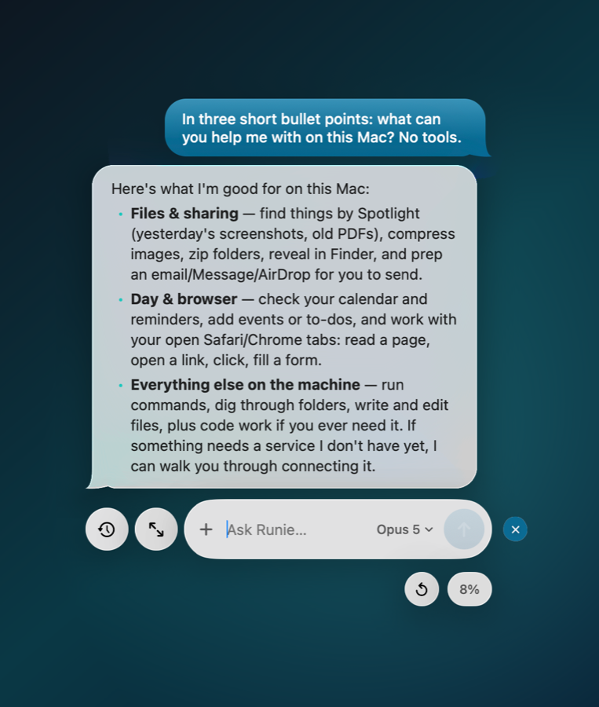
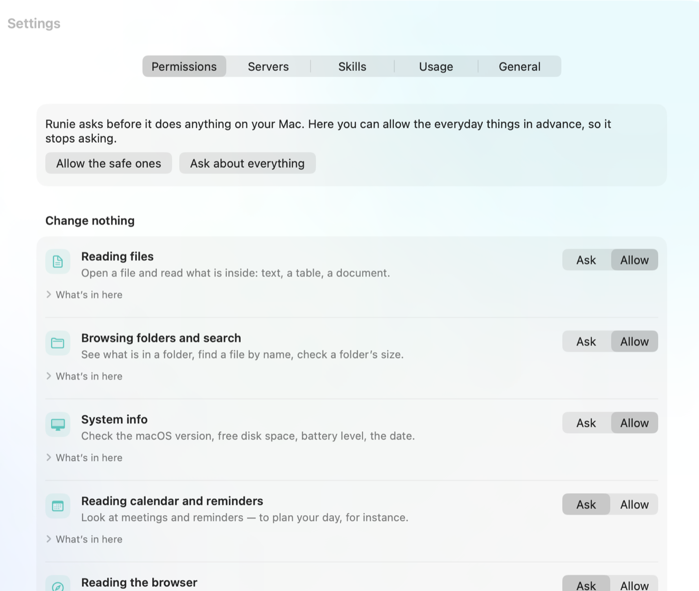

# Runie

**A Mac assistant that runs on Claude Code.**

Runie is a native macOS app: an orb at the edge of the screen, a glass chat above your desktop,
and an agent that works with your files, calendar, reminders and browser. All the intelligence
comes from the Claude Code you already have and your own Claude subscription. Runie has no model
of its own, no cloud of its own, no account of its own.

[Русская версия](README.ru.md)

<p align="center">
  
</p>

## Install

1. Download `Runie-<version>.dmg` from the [releases page](https://github.com/shineexxx/runie/releases)
   and drag Runie into Applications.
2. Open Runie. If Claude Code is not installed yet, or you are not signed in, Runie walks you
   through it right in the chat — it installs Claude Code itself and opens the sign-in page.

The app is signed with a Developer ID certificate but is not notarized by Apple yet, so on the
first launch macOS says it cannot verify the developer. Open it once through the context menu:
**right-click Runie → Open → Open**. After that it launches normally.

From then on the app updates itself: once a day it checks the releases on GitHub and installs the
new version without Terminal. Every release is signed with the author’s key.

**Requirements:** macOS 26 or newer and a Claude subscription (Pro or Max).

## What it does

- **Chat at the orb.** The orb lives at the edge of the screen, hides into a bump and steps out
  when needed. Replies with formatting, past conversations, attachments, screenshots of a region.
- **Files.** Spotlight search, image compression, archives, “show in Finder”, preparing an email,
  a message or an AirDrop — you send it yourself.
- **Calendar and reminders.** Today’s meetings and to-dos, creating new ones, a morning plan.
- **Browser.** Safari and Chrome: tabs, page text, open a link, click, fill in a field, run your
  own JavaScript.
- **Permissions in plain words.** Not “the `rm` command” but “Moving and deleting”. Each group can
  be allowed in advance or left to ask.
- **Suggestions under the input** are written by AI from what is happening on the computer: recent
  files, running apps, today’s meetings.
- **It extends itself.** Runie connects MCP servers to services, writes its own when there is none,
  and saves skills. API keys live in the Keychain, never in files.
- **Quick commands.** Your own instruction, called with `/command` or just by asking in your words.

Everything Runie connects and creates lives in its own plugin: Claude Code in Terminal stays
untouched.

<p align="center">
  
</p>

## Language

The interface follows your macOS language: Russian and English are built in. The language Runie
*replies* in is a separate setting — Settings → General → Reply language.

## Privacy

- No telemetry, no accounts, no servers of ours. Nothing leaves your Mac except what you send to
  Claude through `claude` yourself.
- Runie never touches Claude Code’s OAuth tokens and never calls the API directly.
- Keys for connected services live in the Keychain; the model never sees them.
- Nothing irreversible happens without your confirmation.

## Build from source

```bash
xcodebuild -project Runie.xcodeproj -scheme Runie -configuration Debug build
swift test --package-path Packages/RunieKit
```

Release (build, sign, DMG, appcast and a GitHub release):

```bash
scripts/release.sh 0.2.1
```

By default it signs with the local certificate from `scripts/make-signing-cert.sh`. With a
Developer ID and notarization:

```bash
RUNIE_SIGN_IDENTITY="Developer ID Application: Name (TEAMID)" \
RUNIE_NOTARY_PROFILE=runie scripts/release.sh 0.2.1
```

## Layout

```
App/Runie/            the app (SwiftUI, AppKit)
Packages/RunieKit/    all the logic, tested without UI
scripts/              signing, icon, DMG, release
appcast.xml           the update feed for Sparkle
```

Everything specific to Claude Code — flag names, the shape of the JSON, resuming sessions — is
isolated in a single adapter, so a change in the CLI cannot break the whole app.

## License

MIT. See [LICENSE](LICENSE).
