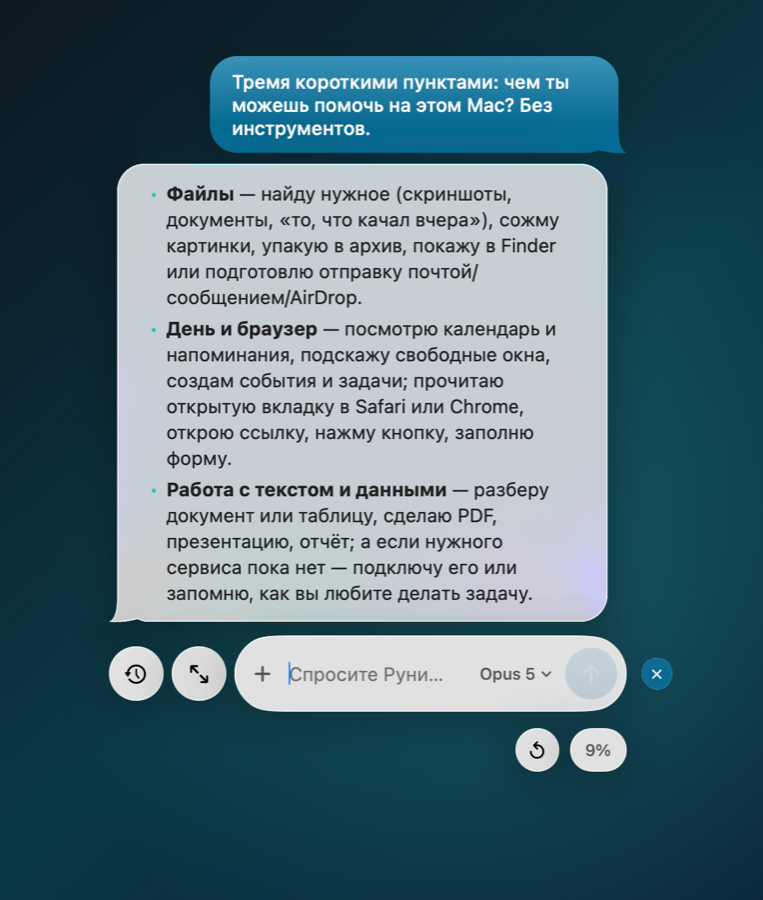
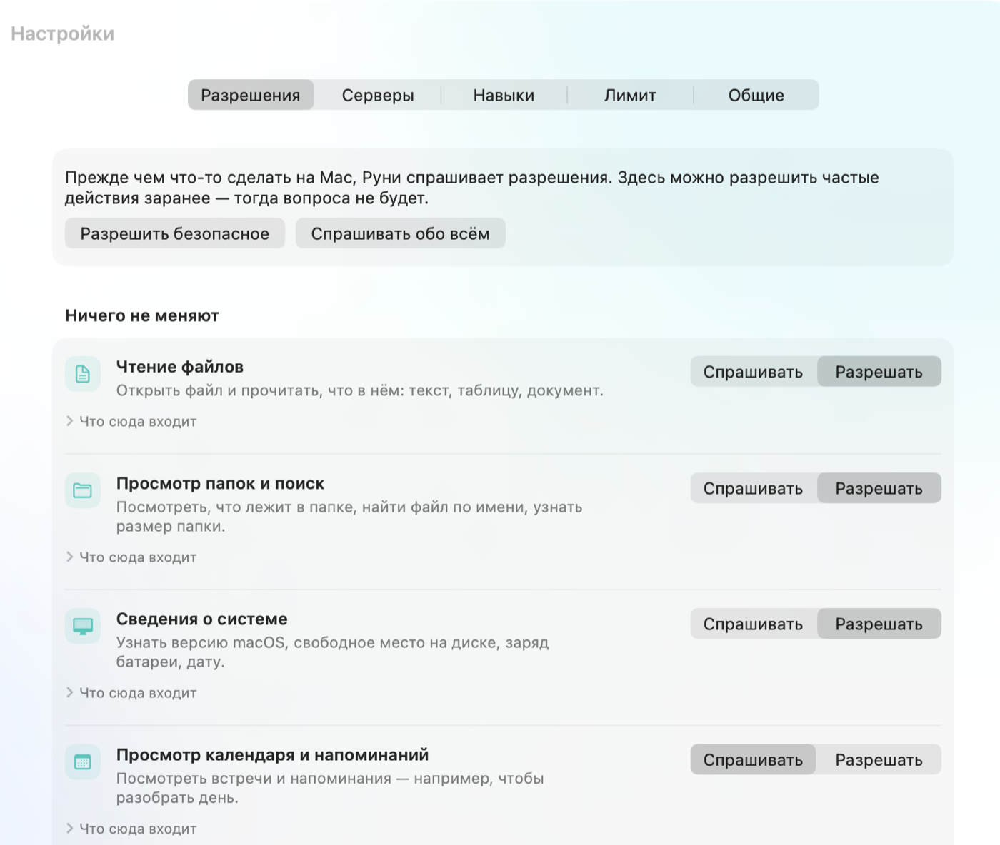

# Runie

**Ассистент для Mac поверх Claude Code.**

Runie — нативное macOS-приложение: орб у края экрана, стеклянный чат над рабочим столом и агент,
который работает с вашими файлами, календарём, напоминаниями и браузером. Весь интеллект берётся
из установленного Claude Code и вашей подписки Claude. Своей модели, своего облака, своего
аккаунта у Runie нет.

[English version](README.md)

<p align="center">
  
</p>

## Установка

1. Скачайте `Runie-<версия>.dmg` со страницы [релизов](https://github.com/shineexxx/runie/releases)
   и перетащите Runie в «Программы».
2. Откройте Runie. Если Claude Code ещё не установлен или вы не вошли в аккаунт, Руни проведёт по
   шагам прямо в чате: установит Claude Code сам и откроет страницу входа.

Приложение подписано сертификатом Developer ID, но пока не прошло нотаризацию Apple, поэтому при
первом запуске macOS скажет, что не может проверить разработчика. Откройте его один раз через
контекстное меню: **правый клик по Runie → «Открыть» → «Открыть»**. Дальше оно запускается обычным
двойным щелчком.

После установки приложение обновляется само: раз в сутки смотрит релизы на GitHub и ставит новую
версию без Терминала. Каждый выпуск подписан ключом автора.

**Нужно:** macOS 26 или новее и подписка Claude (Pro или Max).

## Что умеет

- **Чат у орба.** Орб живёт у края экрана, прячется в горбик и выходит, когда нужен. Ответы с
  разметкой, прошлые разговоры, вложения, снимок области экрана.
- **Файлы.** Поиск через Spotlight, сжатие картинок, архивы, «показать в Finder», подготовка
  письма, сообщения или AirDrop — отправляете вы сами.
- **Календарь и напоминания.** Встречи и дела на сегодня, создание, утренний разбор дня.
- **Браузер.** Safari и Chrome: вкладки, текст страницы, открыть ссылку, нажать, заполнить поле,
  выполнить свой JavaScript.
- **Разрешения по-человечески.** Не «команда `rm`», а «Перемещение и удаление». Каждую группу
  можно разрешить заранее или оставить с вопросом.
- **Подсказки под полем** придумывает ИИ по тому, что происходит на компьютере: недавние файлы,
  открытые программы, встречи на сегодня.
- **Расширение на ходу.** Руни сам подключает MCP-серверы к сервисам, пишет свои, если готового
  нет, и сохраняет навыки. Ключи API хранятся в Связке ключей, а не в файлах.
- **Быстрые команды.** Своя инструкция вызывается через `/команда` или просто похожей просьбой.

Всё, что Руни подключает и создаёт, живёт в его собственном плагине: Claude Code в терминале
остаётся нетронутым.

<p align="center">
  
</p>

## Язык

Интерфейс идёт за языком macOS: русский и английский встроены. Язык, на котором Руни *отвечает*, —
отдельная настройка: «Настройки» → «Общие» → «Язык ответов».

## Приватность

- Никакой телеметрии, аккаунтов и серверов проекта. Данные не покидают ваш Mac, кроме того, что вы
  сами отправляете Claude через `claude`.
- Runie не трогает OAuth-токены Claude Code и не ходит в API напрямую.
- Ключи подключённых сервисов лежат в Связке ключей; модель их не видит.
- Ничего необратимого без подтверждения человека.

## Сборка из исходников

```bash
xcodebuild -project Runie.xcodeproj -scheme Runie -configuration Debug build
swift test --package-path Packages/RunieKit
```

Выпуск (сборка, подпись, DMG, appcast и релиз на GitHub):

```bash
scripts/release.sh 0.2.1
```

По умолчанию подписывает локальным сертификатом из `scripts/make-signing-cert.sh`. С Developer ID
и нотаризацией:

```bash
RUNIE_SIGN_IDENTITY="Developer ID Application: Имя (TEAMID)" \
RUNIE_NOTARY_PROFILE=runie scripts/release.sh 0.2.1
```

## Структура

```
App/Runie/            приложение (SwiftUI, AppKit)
Packages/RunieKit/    вся логика, тестируется без UI
scripts/              подпись, иконка, DMG, выпуск
appcast.xml           лента обновлений для Sparkle
```

Всё, что специфично для Claude Code — имена флагов, форма JSON, продолжение сессий — изолировано
в одном адаптере, чтобы изменения в CLI не ломали приложение целиком.

## Лицензия

MIT. См. [LICENSE](LICENSE).
